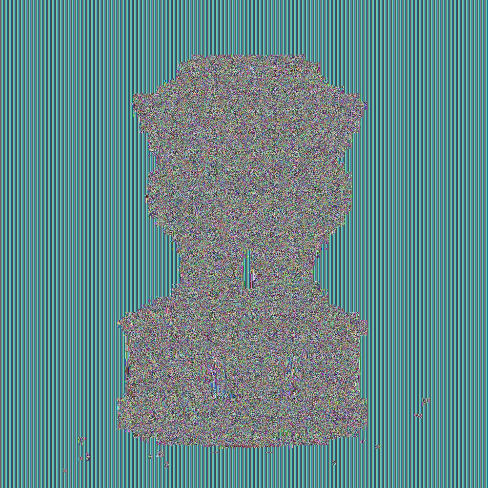
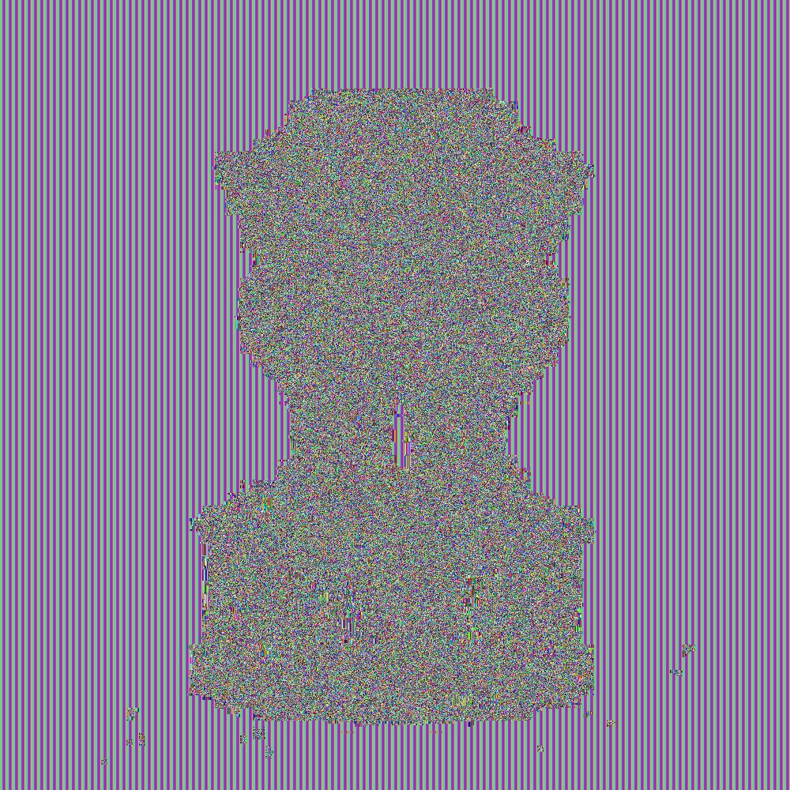

# General Info
A quick script to encrypt and decrypt images

Author:         Ravi Rahar  
Language Used:  Python  
Libraries Used: pycryptodomex, opencv-python, rsa

# Steps to Test
-   **Install Libraries**  
        `$ pip install nympy, opencv-python, pycryptodomex, rsa`  
  
-   **Place image in this folder, rename it as "target.jpg"**  
  
-   **run Test.py**  
        `$ python Test.py`  
  
# Algorithms

| Algorithm | Block Size(Bits) | Key Size(Bits) |
|-----------|------------------|----------------|
| DES       | 64               | 56             |
| 3DES      | 64               | 168            | | AES       | 128              | 256            |
| RSA       | 128              | 256            |

# Files Division:

| Sr No | Files                                                                                |
|-------|--------------------------------------------------------------------------------------|
|   1   | Target file (Targettext.txt) (original image split in channels)                      |
|   2   | Python code (5 files) (Test.py, Algoname.py)                                         |
|       | ( All keys are generated each time, but can be exported and reused. API is provided )|
|   3   | Table with encryption time for each algorithm in a pdf                               |
|   4   | Four Cipher arrays (Algoname.txt)                                                    |
|   5   | Four Cipher images (Algoname.jpeg)                                                   |

# Screenshots

- Original Image

- DES Encrypted

- 3DES Encrypted

- AES Encrypted

- RSA Encrypted

